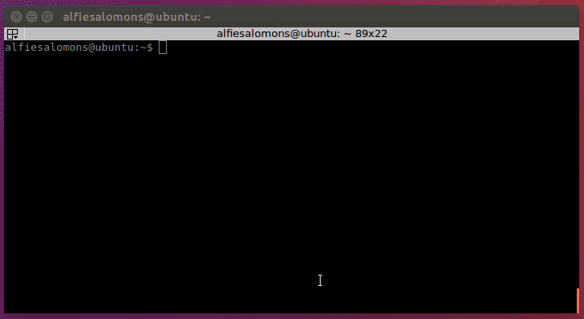

# Git Switch

Switch git users quickly.



## Installation

#### MacOS

```bash
$ brew install alfiesal/tap/git-switch
```

#### Linux
Download the latest version of git-switch from the [releases page](https://github.com/alfiesal/git-switch/releases) and then run:

```bash
$ mkdir git-switch && tar -zxvf git-switch_0.4.6_Linux_x86_64.tar.gz -C ./git-switch && sudo mv git-switch/git-switch /usr/local/bin
```

Don't forget to replace git-switch_0.4.6_Linux_x86_64.tar.gz with the archive that you've downloaded.


## Usage

```bash
Git Switch - Switch git users quickly. Switches locally by default

USAGE:
   git-switch [global options] command [command options] [arguments...]

COMMANDS:
   list, ls   list all available users
   add, a     add a user to the list
   reset, a   clear profile list
   switch, s  switch git users. Switches locally by default
   help, h    Shows a list of commands or help for one command

GLOBAL OPTIONS:
   --help, -h  show help (default: false)
```
